# 🔐 DeepGuard — Cyber Security per la Sanità tramite Reinforcement Learning

[](https://www.python.org/)
[](https://pytorch.org/)
[](https://gymnasium.farama.org/)
[](https://github.com/Limmen/gym-idsgame)
[](https://colab.research.google.com/)
[](LICENSE)

> Simulazione di scenari di attacco e difesa in reti informatiche sanitarie tramite algoritmi di Reinforcement Learning. Progetto sviluppato per **DeepGuard Inc.** nell'ambito della sicurezza informatica per il settore healthcare.

---

## 📋 Indice

- [Contesto e obiettivi](#contesto-e-obiettivi)
- [Ambiente di simulazione](#ambiente-di-simulazione)
- [Algoritmi implementati](#algoritmi-implementati)
  - [SARSA](#sarsa--sezione-1)
  - [DDQN](#ddqn--sezione-2)
- [Architettura del progetto](#architettura-del-progetto)
- [Risultati](#risultati)
- [Analisi critica](#analisi-critica)
- [Installazione e utilizzo](#installazione-e-utilizzo)
- [Fix tecnici applicati](#fix-tecnici-applicati)
- [Riferimenti](#riferimenti)

---

## Contesto e obiettivi

Le reti informatiche sanitarie custodiscono dati sensibili dei pazienti e devono garantire conformità normativa (GDPR, HIPAA). La crescente sofisticazione degli attacchi informatici rende necessari sistemi difensivi adattativi e capaci di apprendere.

Questo progetto implementa un sistema di **simulazione attacco/difesa** basato su Reinforcement Learning, con i seguenti obiettivi:

| Obiettivo | Descrizione |
|---|---|
| **Difesa adattiva** | Addestrare agenti difensivi in scenari simulati per sviluppare strategie robuste |
| **Identificazione vulnerabilità** | Simulare attacchi per rilevare debolezze prima che vengano sfruttate |
| **Ottimizzazione risorse** | Automatizzare la simulazione riducendo il carico di lavoro manuale |
| **Benchmark algoritmi** | Confrontare approcci tabellari (SARSA) e deep (DDQN) sullo stesso scenario |

---

## Ambiente di simulazione

L'ambiente utilizzato è [`gym-idsgame`](https://github.com/Limmen/gym-idsgame) — un Markov Game astratto per OpenAI Gym che simula interazioni attacco/difesa su reti informatiche.

### Modello del gioco

`gym-idsgame` implementa un **Markov Game a due agenti** dove attaccante e difensore si affrontano in una rete simulata:

```
┌──────────────────────────────────────────────────────────────────────────┐
│             RETE SIMULATA — configurazione base (v0)                     │
│                                                                          │
│  [Attaccante] ──attacca──▶ [Server] ◀──difende── [Difensore (agente RL)] │
│                                                                          │
│  Layers: 1  │  Server/layer: 1  │  Tipi attacco: 10                      │
└──────────────────────────────────────────────────────────────────────────┘
```

### Configurazioni utilizzate

| Ambiente | Ruolo agente | Avversario | Note |
|---|---|---|---|
| `idsgame-random_attack-v0` | Difensore | Policy random | Configurazione base |
| `idsgame-maximal_attack-v0` | Difensore | Policy maximal (deterministico) | Avversario deterministico e aggressivo; la sua regolarità può renderlo più prevedibile per il difensore rispetto a un attaccante stocastico |
| `idsgame-random_attack-v3` | Difensore | Policy random | Spazio osservazioni/azioni più ampio (Sezione 4) |

### Caratteristiche tecniche rilevate

```
obs_space.shape   (dichiarata) : (1, 11)
obs.flatten()     (reale)      : (33,)   ← include info di entrambi gli agenti
N_ACTIONS                      : 30
step() input                   : (attacker_action, defender_action)  ← sempre tupla
step() output reward           : (att_reward, def_reward)            ← sempre tupla
info                           : {'moved': bool}  ← attack_success NON esposto
```

> ⚠️ **Nota API:** `gym-idsgame` mantiene l'interfaccia a due agenti anche nelle varianti single-agent. Il nostro agente controlla solo `defender_action`; `attacker_action=0` è un placeholder ignorato dall'ambiente.

> ⚠️ **Nota hack_rate:** `gym-idsgame` non espone `info['attack_success']`. L'hack_rate è calcolato a livello episodio: un episodio è considerato compromesso se il difensore riceve almeno una reward negativa durante l'episodio (`reward < 0`).

---

## Algoritmi implementati

### SARSA — Sezione 1

**SARSA** (State-Action-Reward-State-Action) è un algoritmo **on-policy** di Temporal Difference learning.

#### Perché SARSA per random_attack?

In un ambiente con avversario stocastico, SARSA è preferibile a Q-learning perché:
- Impara il valore della policy che **sta effettivamente eseguendo** (inclusa l'esplorazione)
- Produce stime più **conservative e robuste** sotto incertezza
- Evita di sovrastimare stati che in pratica vengono raggiunti con policy non ancora converge

#### Update rule

$$Q(s,a) \leftarrow Q(s,a) + \alpha \left[ r + \gamma \cdot Q(s', a') - Q(s,a) \right]$$

dove $a'$ è l'azione scelta dalla **stessa** policy ε-greedy a partire da $s'$ — non il massimo ipotetico come in Q-learning.

#### Implementazione

```python
# Q-table come defaultdict: stati non visitati → zeros automaticamente
Q = defaultdict(lambda: np.zeros(N_ACTIONS))

# Chiave stato: serializzazione esatta senza discretizzazione manuale
state_key = obs.flatten().tobytes()

# Loop SARSA: a' scelto PRIMA dell'aggiornamento (on-policy)
a = epsilon_greedy(Q, s, epsilon)          # scelta iniziale
while not done:
    obs_next, reward, done = env_step(env, a)
    a_next = epsilon_greedy(Q, s_next, epsilon)   # stessa policy
    Q[s][a] += alpha * (reward + gamma * Q[s_next][a_next] - Q[s][a])
    s, a = s_next, a_next
```

#### Iperparametri SARSA

| Parametro | Valore | Motivazione |
|---|---|---|
| `ALPHA` | 0.001 | Learning rate conservativo per Q-table densa |
| `GAMMA` | 0.99 | Orizzonte temporale lungo |
| `EPSILON_START` | 1.0 | Esplorazione totale iniziale |
| `EPSILON_MIN` | 0.01 | Soglia minima garantita |
| `EPSILON_DECAY` | 0.9995 | Decay lento: ε≈0.10 a ep 4600, ε≈0.01 a ep 9000 |

---

### DDQN — Sezione 2

**Double Deep Q-Network** (van Hasselt et al. 2016) estende il DQN base con una rete neurale per l'approssimazione di Q e la separazione online/target per eliminare l'overestimation bias.

#### Problema del DQN base: overestimation bias

Il DQN classico usa la **stessa rete** per selezionare e valutare l'azione ottimale:

$$\text{DQN: } y = r + \gamma \cdot \max_{a'} Q_{\theta^-}(s', a')$$

Il `max` sullo stesso segnale di stima amplifica sistematicamente gli errori → stime Q gonfiate → policy subottimale.

#### Soluzione DDQN: separazione selezione/valutazione

$$\text{DDQN: } y = r + \gamma \cdot Q_{\theta^-}\!\left(s',\; \underset{a'}{\arg\max}\; Q_\theta(s', a')\right)$$

- **Rete online** $Q_\theta$ → seleziona quale azione è la migliore
- **Rete target** $Q_{\theta^-}$ → valuta quanto vale quell'azione

#### Architettura QNetwork

```
Input(33) → Linear(128) → ReLU → Linear(128) → ReLU → Linear(30)

Parametri totali: 22,174
Device: CPU (Colab free tier)
```

#### Replay Buffer

```python
# Buffer circolare FIFO con capacità 50.000 transizioni
# Le obs vengono appiattite al push: shape garantita (OBS_DIM_FLAT,)
buffer = deque(maxlen=50_000)

# Campionamento uniforme casuale → rompe correlazione temporale
batch = random.sample(buffer, BATCH_SIZE)
```

#### Iperparametri DDQN

| Parametro | Valore | Motivazione |
|---|---|---|
| `ALPHA_DDQN` | 0.0005 | LR conservativo per stabilità |
| `GAMMA` | 0.99 | Stesso di SARSA per confronto diretto |
| `BATCH_SIZE` | 64 | Standard per MLP su spazio piccolo |
| `BUFFER_SIZE` | 50.000 | Sufficiente per 10k episodi |
| `TARGET_UPDATE` | 500 | Hard update ogni 500 step |
| `HIDDEN_DIM` | 128 | Bilanciamento capacità/velocità |

---

## Architettura del progetto

```
deepguard-rl/
│
├── DeepGuard_RL_CyberSecurity.ipynb   # Notebook principale (Sezioni 0-3 + 4)
│
├── README.md                          # Questo file
│
├── results/
│   ├── sarsa_reward_curve.png         # Reward SARSA su random_attack-v0
│   ├── sarsa_hack_rate.png            # Hack rate SARSA
│   ├── ddqn_random_reward.png         # Reward DDQN su random_attack-v0
│   ├── ddqn_random_hack_rate.png      # Hack rate DDQN random
│   ├── ddqn_maximal_reward.png        # Reward DDQN su maximal_attack-v0
│   ├── ddqn_maximal_hack_rate.png     # Hack rate DDQN maximal
│   ├── sarsa_v3_reward_curve.png      # Reward SARSA su random_attack-v3
│   ├── sarsa_v3_hack_rate.png         # Hack rate SARSA v3
│   ├── ddqn_v3_reward_curve.png       # Reward DDQN su random_attack-v3
│   ├── ddqn_v3_hack_rate.png          # Hack rate DDQN v3
│   ├── comparison_hack_rate.png       # Confronto hack rate tutti gli scenari
│   └── comparison_reward.png          # Confronto reward tutti gli scenari
│
└── docs/
    └── architecture.png               # Diagramma architettura DDQN
```

### Struttura del notebook

```
Sezione 0 — Setup & Configurazione
    ├── 0-A  Installazione dipendenze (con fix noti)
    ├── 0-A2 Verifica installazione
    ├── 0-B  Import globali e costanti
    ├── 0-C  Esplorazione ambiente (rileva OBS_DIM_FLAT reale)
    └── 0-D  Utility functions condivise

Sezione 1 — SARSA
    ├── 1-A  Q-table, ε-greedy, sarsa_update
    ├── 1-B  Training loop (10k episodi su v0, 20k su v3)
    ├── 1-C  Visualizzazione risultati
    └── 1-D  Analisi quantitativa

Sezione 2 — DDQN
    ├── 2-A  Architettura rete neurale
    ├── 2-B  ReplayBuffer
    ├── 2-C  DDQNAgent (online + target net)
    ├── 2-D  Training su random_attack-v0
    ├── 2-E  Training su maximal_attack-v0
    └── 2-F  Visualizzazione risultati

Sezione 3 — Analisi Comparativa
    ├── 3-A  Confronto visivo (hack rate + reward)
    ├── 3-B  Report quantitativo
    └── 3-C  Analisi critica approfondita

Sezione 4 — Confronto v0 vs v3: Scaling della Complessità
    ├── 4-A  Configurazione ambiente v3 e rilevamento dimensioni
    ├── 4-B  Training SARSA su random_attack-v3
    ├── 4-C  Training DDQN su random_attack-v3
    ├── 4-D  Visualizzazione risultati v3
    ├── 4-E  Confronto diretto v0 vs v3 (hack rate + reward)
    └── 4-F  Report comparativo e analisi effetto complessità
```

---

## Risultati

### Nota sul calcolo dell'hack_rate

`gym-idsgame` non espone `info['attack_success']` nel dizionario restituito da `step()`.
L'hack_rate è calcolato a livello episodio: un episodio è considerato compromesso
se il difensore riceve almeno una reward negativa (`reward < 0`) durante l'episodio.
I valori riportati di seguito riflettono questa logica post-fix.

### Metriche finali — Sezioni 1-2 (evaluation greedy, 100 episodi ogni 500 di training)

| Algoritmo | Ambiente | Hack rate finale | Reward finale | Δ Reward |
|---|---|---|---|---|
| SARSA | random_attack-v0 | 0.000 | 0.660 | -0.020 |
| DDQN | random_attack-v0 | 0.000 | 0.600 | -0.060 |
| DDQN | maximal_attack-v0 | 0.000 | 0.760 | +0.060 |

### Metriche finali — Sezione 4 (v0 vs v3, evaluation greedy)

| Algoritmo | Ambiente | Hack rate finale | Reward finale |
|---|---|---|---|
| SARSA | random_attack-v0 | 0.000 | 0.660 |
| DDQN  | random_attack-v0 | 0.000 | 0.600 |
| SARSA | random_attack-v3 | 0.000 | 0.780 |
| DDQN  | random_attack-v3 | 0.000 | 0.900 |

> I valori riportati sono indicativi dei risultati osservati in una singola
> esecuzione dei nostri esperimenti. In RL run diversi possono produrre risultati
> differenti. L'effetto dell'aumento di complessità sulle metriche va verificato
> empiricamente e non assunto automaticamente.

### Curve di reward — SARSA (v0)

| Reward per episodio | Hack rate nel tempo |
|---|---|
| 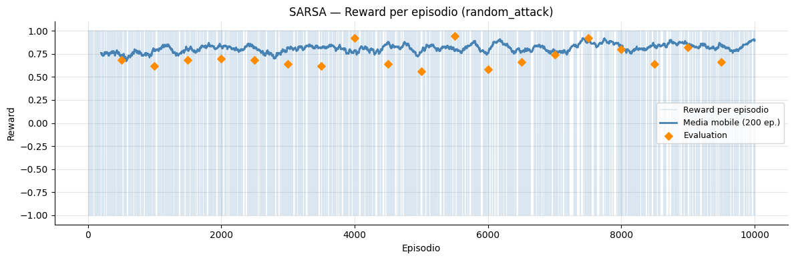 | 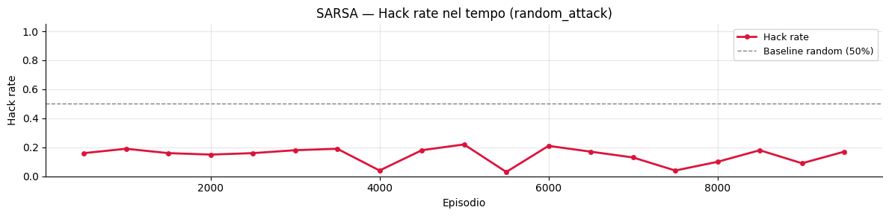 |

### Curve di reward — DDQN random_attack (v0)

| Reward per episodio | Hack rate nel tempo |
|---|---|
| 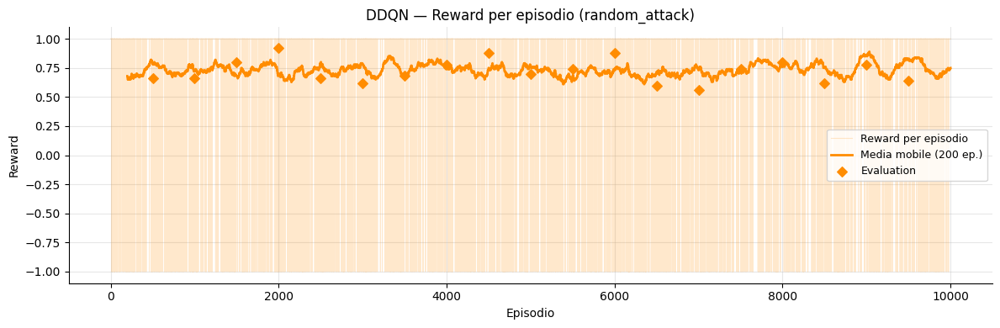 | 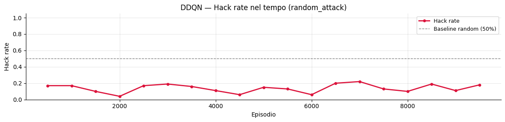 |

### Curve di reward — DDQN maximal_attack (v0)

| Reward per episodio | Hack rate nel tempo |
|---|---|
| 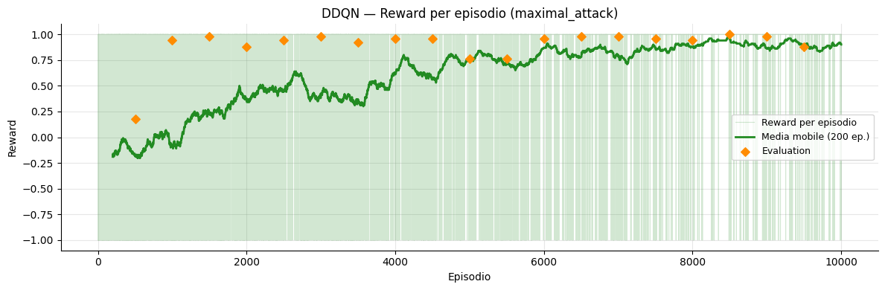 | 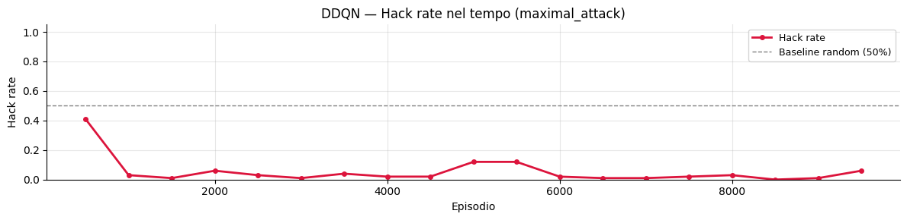 |

### Curve di reward — SARSA (v3)

| Reward per episodio | Hack rate nel tempo |
|---|---|
| 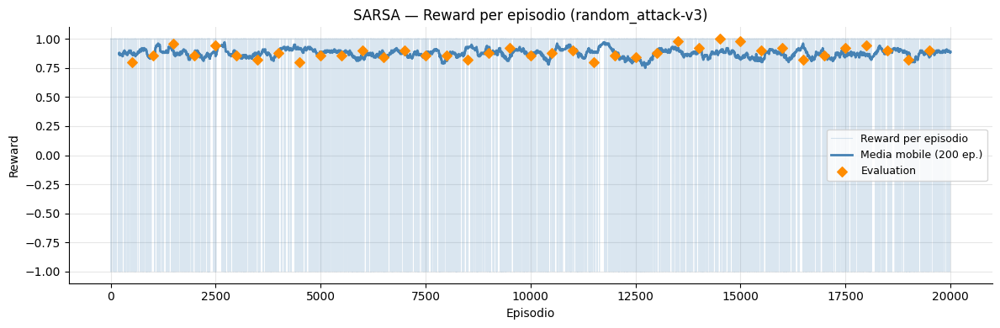 | 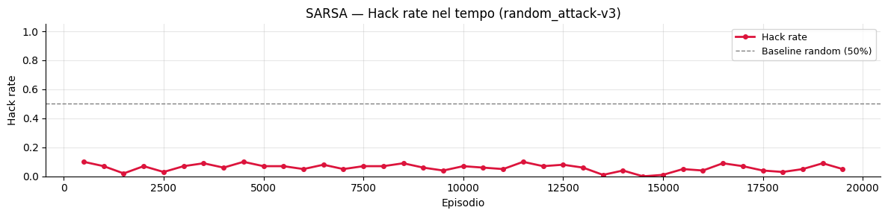 |

### Curve di reward — DDQN random_attack (v3)

| Reward per episodio | Hack rate nel tempo |
|---|---|
| 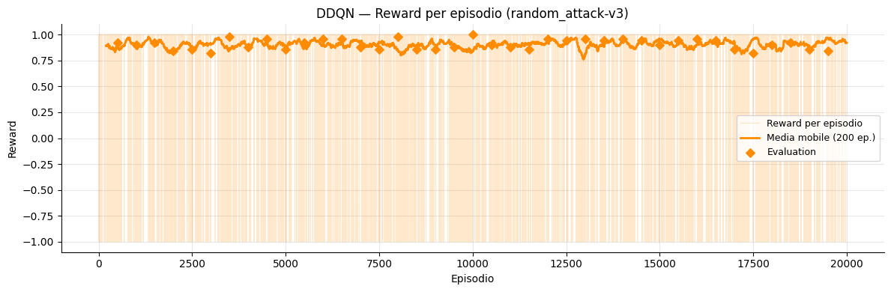 | 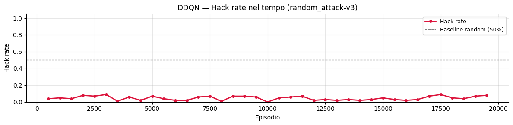 |

### Confronto comparativo

| Confronto hack rate | Confronto reward |
|---|---|
| 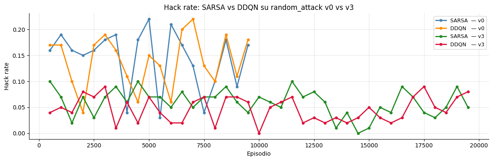 | 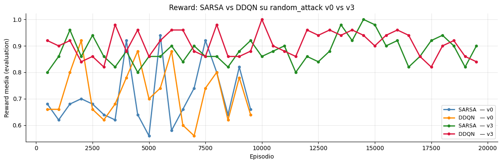 |

----
## Analisi critica

### 1 — Hack_rate: bug implementativo e fix applicato

Nella prima versione del notebook l'hack_rate risultava artificialmente nullo su tutti
gli scenari per un bug implementativo: il codice usava `info.get('attack_success', False)`
ma `gym-idsgame` non espone questa chiave — il dizionario `info` contiene esclusivamente
`{'moved': bool}`.

Dopo il fix, l'hack_rate è calcolato a livello episodio tramite un flag `episode_hacked`
impostato a `True` se il difensore riceve almeno una reward negativa durante l'episodio.
I valori osservati nei nostri esperimenti riflettono questa logica corretta.

**Implicazione metodologica:** l'hack_rate è una metrica rilevante per confrontare
SARSA e DDQN, ma il suo valore effettivo dipende dalla configurazione dell'ambiente
e va letto nei risultati sperimentali — non può essere assunto a priori come discriminante.

### 2 — DDQN-maximal performa meglio di DDQN-random (risultato controintuitivo)

```
DDQN random_attack  → reward finale 0.600, loss finale ~1.55
DDQN maximal_attack → reward finale 0.760, loss finale ~0.003
```

Il **maximal_attack è deterministico**: attacca sempre lo stesso nodo con la stessa logica.
È teoricamente severo come avversario, ma la sua regolarità lo rende più prevedibile
e quindi più facile da apprendere per il difensore rispetto a un attaccante completamente
stocastico. Questa regolarità permette al difensore di convergere su una
**contro-strategia stabile e specifica**, producendo loss bassissima e reward alta.

Il **random_attack introduce varianza strutturale**: il difensore deve coprire una
distribuzione di attacchi imprevedibili. Il target di Bellman varia di più tra batch
→ loss più alta, convergenza più lenta.

> In termini di teoria RL: il maximal_attack produce un MDP con dinamiche più
> stazionarie → più facile da approssimare con una rete neurale.

### 3 — Loss DDQN-random: picco a ep 3500, poi discesa

```
ep  500  → loss  0.019  (buffer quasi vuoto)
ep 3500  → loss  7.637  ← PICCO (massima varianza)
ep 9500  → loss  1.557  (convergenza)
```

Questo è il comportamento **atteso e sano** in DQN/DDQN:
- **Fase 1** (0-500): buffer vuoto, pochi aggiornamenti, loss bassa
- **Fase 2** (500-3500): ε alta, policy casuale, target rumorosi → loss cresce
- **Fase 3** (3500+): ε scende, policy si stabilizza, segnale coerente → loss scende

### 4 — SARSA: azione dominante al 91.4% (v0) e 96.2% (v3)

```
v0 — Azione  0: 16798 stati (91.4%)
v3 — Azione  0: ~55000 stati (96.2%)
```

La Q-table ha valori quasi tutti a zero (std=0.0006 su v0). L'azione 0 è preferita
non perché genuinamente ottimale, ma perché è la prima a ricevere un rinforzo positivo
minimo su stati poco visitati — `argmax` restituisce l'indice 0 in caso di parità.
Su v3 la degenerazione è più accentuata, coerente con il limite intrinseco degli approcci
tabellari al crescere della complessità dello spazio degli stati.

Questo conferma il **limite strutturale degli approcci tabellari**: mancanza di
generalizzazione tra stati simili, policy degenerate su stati poco visitati.

### 5 — Effetto della complessità: v0 vs v3

Il DDQN è teoricamente più adatto a spazi di stato più ampi grazie alla generalizzazione
neurale. Il vantaggio effettivo rispetto a SARSA su v3 va letto nelle metriche osservate
nei nostri esperimenti: l'aumento di complessità espande lo spazio di osservazioni e
azioni, ma non si può assumere automaticamente che renda l'hack_rate più discriminante
o il vantaggio del DDQN più marcato.

## Key Insights

I principali risultati osservati negli esperimenti sono i seguenti:

1. **Bug della metrica hack_rate**
   - L'ambiente `gym-idsgame` non espone `attack_success` nel dizionario `info`.
   - Il calcolo corretto dell'hack rate richiede una metrica **episodio-based** basata su `reward < 0`.
   - Senza questo fix, l'hack rate risulta artificialmente nullo e porta a conclusioni fuorvianti.

2. **Attaccante deterministico vs stocastico**
   - Il `maximal_attack` è più aggressivo ma anche più regolare e prevedibile.
   - Questa regolarità consente al difensore DDQN di apprendere una contro-strategia più stabile rispetto al caso `random_attack`.

3. **Limiti degli approcci tabellari**
   - SARSA funziona bene come baseline interpretabile su ambienti piccoli.
   - Con l'aumentare della complessità dello spazio degli stati, la Q-table tende però a diventare più sparsa e la policy più degenerata.

4. **Vantaggio potenziale del Deep RL**
   - Il DDQN è teoricamente più adatto a spazi di osservazione più ampi grazie alla generalizzazione neurale.
   - Il vantaggio effettivo rispetto a SARSA va però verificato empiricamente sui risultati del run.

## Lessons Learned

Durante lo sviluppo del progetto sono emerse alcune lezioni pratiche:

- Le API di ambienti RL accademici possono differire dalla documentazione o dal comportamento atteso.
- Prima di interpretare le metriche è fondamentale verificare che siano allineate ai segnali realmente restituiti dall'ambiente.
- Nel Deep RL il controllo delle dimensioni di osservazioni, azioni e tensori è cruciale per evitare mismatch architetturali.
- Replay buffer, esplorazione ε‑greedy e inizializzazione casuale introducono variabilità tra run.

Questo progetto mostra che una parte importante del lavoro in Reinforcement Learning consiste nel validare ambiente, metriche e assunzioni sperimentali.

## Future Work

Possibili estensioni del progetto:

- test su ambienti più complessi (`v5`, `v10`);
- esecuzione di più run con seed differenti per stimare varianza e robustezza dei risultati;
- confronto con architetture Deep RL più avanzate (Dueling DQN, PPO);
- introduzione di scenari di self‑play o attaccanti RL per aumentare il realismo del benchmark.

----

## Installazione e utilizzo

### Requisiti

- Google Colab (raccomandato) **oppure** Python 3.12+ locale
- GPU opzionale (il progetto gira correttamente su CPU)

### Avvio rapido su Google Colab

1. Aprire il notebook su Google Colab tramite il badge in cima
2. Eseguire le celle in ordine dalla Sezione 0
3. Attendere il completamento del training (~15-20 min su CPU Colab per le Sezioni 1-3)

### Installazione locale

```bash
# Clona questo repo
git clone https://github.com/tuousername/deepguard-rl.git
cd deepguard-rl

# Clona gym-idsgame
git clone https://github.com/Limmen/gym-idsgame.git

# Installa dipendenze
pip install -e ./gym-idsgame --no-deps
pip install "gymnasium==0.26.3" numpy matplotlib seaborn tqdm
pip install torch torchvision opencv-python imageio
pip install jsonpickle tensorboard scikit-learn
pip install pyglet==1.5.15 --no-deps

# Fix NumPy 2.0 (in ogni script Python prima degli import gym_idsgame)
# import numpy as np
# if not hasattr(np, 'bool8'): np.bool8 = np.bool_
```

### Esecuzione

```bash
jupyter notebook DeepGuard_RL_CyberSecurity.ipynb
```

---

## Fix tecnici applicati

Durante lo sviluppo sono stati identificati e risolti i seguenti problemi, documentati per riferimento futuro:

| # | Problema | Causa | Fix |
|---|---|---|---|
| 1 | `gym_idsgame` non trovato dopo `pip install -e` | `pip install -e` non aggiorna `sys.path` del kernel Colab in esecuzione | `sys.path.insert(0, REPO_PATH)` prima di ogni import |
| 2 | `AttributeError: np.bool8` | Rimosso in NumPy 2.0 (giugno 2024) | `np.bool8 = np.bool_` monkey-patch prima di importare `gym_idsgame` |
| 3 | `TypeError: cannot unpack non-iterable int` | `step()` richiede tupla `(att_action, def_action)` anche in single-agent | Wrapper `env_step(env, defender_action)` con `(0, defender_action)` |
| 4 | `TypeError: unsupported operand type +=: float and tuple` | `step()` restituisce `reward` come tupla `(att_r, def_r)` | Estrazione `reward[1]` (defender) in `env_step` |
| 5 | `RuntimeError: mat1 shapes (64x33) cannot be multiplied (11x128)` | `obs` reale ha shape `(33,)` vs shape dichiarata `(1,11)=11` | `OBS_DIM_FLAT = obs.flatten().shape[0]` rilevato dal reset reale; `flat_obs()` applicato ovunque |
| 6 | `hack_rate` sempre 0 su tutti gli scenari | `info['attack_success']` non è esposto da gym-idsgame (`info = {'moved': bool}`) | Calcolo episodio-based: flag `episode_hacked = True` se `reward < 0` durante l'episodio |
| 7 | Azione fuori range (es. 33) nel report top action SARSA v0 | `zip(*np.unique(...))` ordinava per valore dell'azione (indice numerico), non per frequenza | `zip(counts, unique)` con `counts` prima + `assert all(0 <= a < N_ACTIONS)` |

---

## Riferimenti

| Risorsa | Link |
|---|---|
| `gym-idsgame` repository | [github.com/Limmen/gym-idsgame](https://github.com/Limmen/gym-idsgame) |
| Paper originale (CNSM 2020) | [Finding Effective Security Strategies through RL and Self-Play](https://arxiv.org/abs/2009.08120) |
| Double DQN (van Hasselt et al. 2016) | [Deep Reinforcement Learning with Double Q-learning](https://arxiv.org/abs/1509.06461) |
| DQN originale (Mnih et al. 2015) | [Human-level control through deep reinforcement learning](https://www.nature.com/articles/nature14236) |
| SARSA — Sutton & Barto | [Reinforcement Learning: An Introduction (cap. 6)](http://incompleteideas.net/book/the-book-2nd.html) |

---

## Author

**Francesco Scarano**  
Senior IT Manager | AI Engineering | Data & Digital Solutions

GitHub:  
https://github.com/Nimus74

LinkedIn:  
https://www.linkedin.com/in/francescoscarano/

---

## License

This project is licensed under the MIT License.
